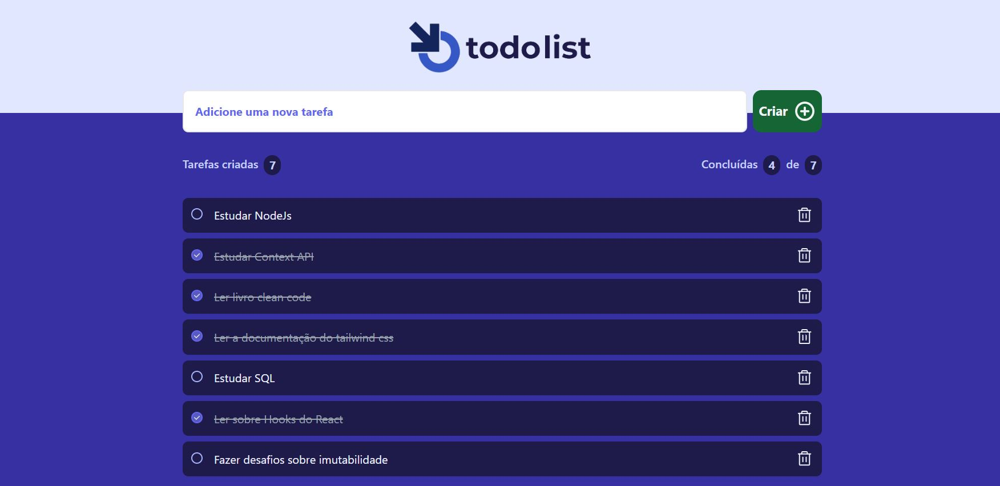

# todo list (Aplicação para gestão de tarefas )

## Capa

 <br/> <br/>

## Funcionalidades da aplicação

- Cadastrar tarefas
- Contabilizar total de tarefas
- Contabilizar tarefas concluídas
- Marcar tarefa como concluída
- Excluir tarefas

## Tecnologias utilizadas

- React
- Typescript
- Vite
- Tailwindcss
- Context API
- Phosphor React
- uuid

## Como executar a aplicação

### Instalação

1. Clone o repositório

```bash
git clone https://github.com/matheusmagnon/todo-list.git
```

2. Acesse a pasta do projeto

```bash
cd todo-list
```

3. Instale as dependências necessárias

```bash
npm install
```

4. Execute o projeto Frontend

```bash
npm run dev
```
